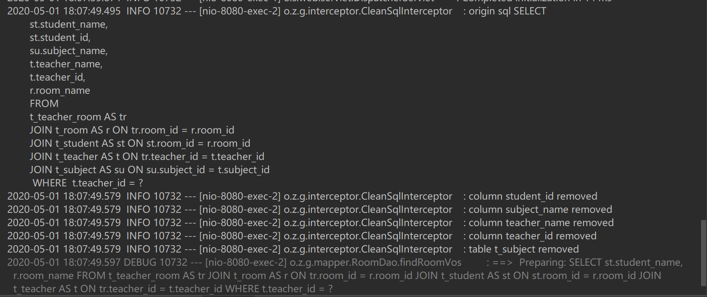
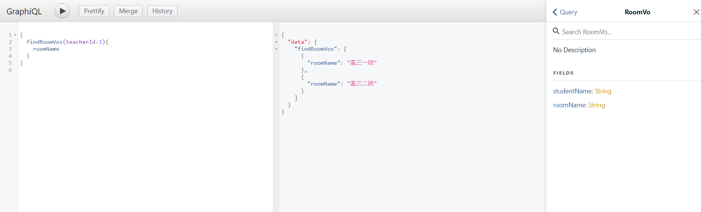
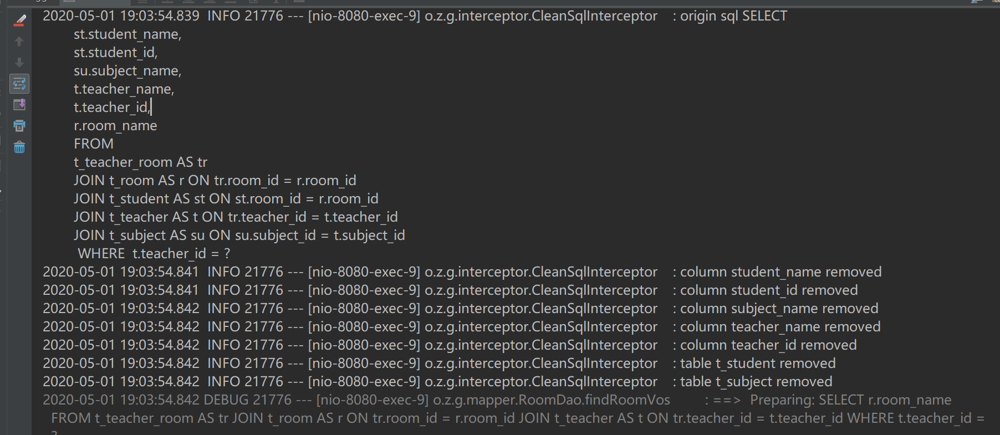

# graph-batis
GraphQL&amp;Mybatis的绝妙搭配
* [GraphQL 中文文档](https://graphql.cn/)

## 性能优势
* 通过GraphQL前端可以向后台发送自己想要的数据结构,知道了前端具体要什么数据,我们就可以根据前端需要的结构查询最少的数据,减轻DB压力.
## 开发优势
* 开发时可以将所有(夸张比喻)关联关系的表统统写一个SQL里,graph-batis-core中的*CleanSqlInterceptor*,将根据前端发送的数据结构,将不需要的查询字和表剔出.一次编写,处处使用!
## 效果演示
    通过graphIQL查询
    地址: http://localhost:8080/graphiql?query=%7B%0A%20%20findRoomVos(teacherId%3A1)%7B%0A%20%20%20%20roomName%0A%20%20%09studentName%0A%20%20%7D%0A%7D%0A

    
    查看日志输出实际只查询了前端传的两个字段

     
     再去掉一个字段

    sql也少查询了这个字段

## TODO
- [x]  代码生成器提供
- [ ]  去除VO,使其符合GraphQL规范
- [ ]  分页
- [ ]  复杂条件查询
- [ ]  向上抽取抽象,使其通用化不局限GraphQL
- [ ]  提供Client