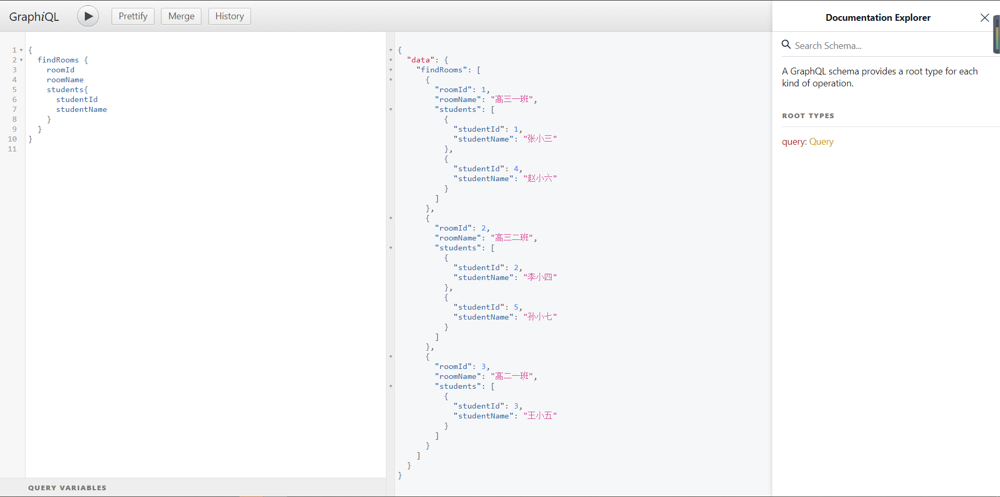

# graph-batis 不是一个框架,而是一种开发模式
GraphQL&amp;Mybatis的绝妙搭配
* [GraphQL 中文文档](https://graphql.cn/)

## 场景痛点还原

针对一些后台,我们可能需要很多列表.

比如下面几个

| 教师名 | 所授科目 |
| ------ | -------- |
| 老唐   | 政治     |
| 老朱   | 音乐     |

| 学生名 | 班级     |
| ------ | -------- |
| 老孙   | 高三一班 |
| 老猪   | 高三一班 |
| 老沙   | 高三一班 |

| 班级     | 教师 | 学生 |
| -------- | ---- | ---- |
| 高三一班 | 老唐 | 老孙 |
| 高三一班 | 老唐 | 老猪 |
| 高三一班 | 老唐 | 老沙 |

| 班级     | 教师 | 科目 |
| -------- | ---- | ---- |
| 高三一班 | 老唐 | 政治 |
| 高三一班 | 老朱 | 音乐 |

还有其他等等类型的查询

小白:这么多列表,我们需要根据每个列表都写一个SQL吗?

大佬:是的,每个列表我们都需要都写一个单独的SQL.要查询最少的数据,减少数据库压力.

小白:写很多SQL好麻烦,占用了我很多开发时间,牺牲一下数据库,我写一个大SQL把所有数据都查出来吧?

大佬:你这样有点缺少职业道德啊.

小白:那让我怎么办?能不能写的又快,又能兼顾让数据库压力小一些?不想加班啊大哥.

大佬:如果你能知道前端要什么数据,可不可以只查他要的数据呢?我了解GraghQL是可以把前端要的数据结构告诉后端的.我们写一个过滤器把不要的字段都去掉,不就行了!

小白:完美!

## 性能优势
* 通过GraphQL前端可以向后台发送自己想要的数据结构,知道了前端具体要什么数据,我们就可以根据前端需要的结构查询最少的数据,减轻DB压力.
## 开发优势
* 开发时可以将所有(夸张比喻)关联关系的表统统写一个SQL里,graph-batis-core中的*CleanSqlInterceptor*,将根据前端发送的数据结构,将不需要的查询字段和表剔出.一次编写,处处使用!
## 效果演示

以下样例都只通过org.zhuyb.graphbatis.mapper.RoomDao#findAll方法定义的如下SQL,自动精简后查询.无需多次编写关联关系

```sql
SELECT
   st.student_name,
   st.student_id,
   su.subject_id,
   su.subject_name,
   t.teacher_id,
   t.teacher_name,
   r.room_id,
   r.room_name
FROM
   t_room AS r
JOIN t_teacher_room AS tr ON tr.room_id = r.room_id
JOIN t_student AS st ON st.room_id = r.room_id
JOIN t_teacher AS t ON t.teacher_id = tr.teacher_id
JOIN t_subject AS su ON su.subject_id = t.subject_id
```

进入graph-batis-example目录执行 mvn spring-boot:run启动服务后,打开下方链接打开graphiql
http://localhost:8080/graphiql?query=%7B%0A%20%20findRooms%20%7B%0A%20%20%20%20roomId%0A%20%20%20%20roomName%0A%20%20%20%20teachers%7B%0A%20%20%20%20%20%20teacherName%0A%20%20%20%20%7D%0A%20%20%7D%0A%7D%0A


实际执行SQL

```sql
SELECT
   t.teacher_id,
   t.teacher_name,
   r.room_id,
   r.room_name
FROM
   t_room AS r
JOIN t_teacher_room AS tr ON tr.room_id = r.room_id
JOIN t_teacher AS t ON t.teacher_id = tr.teacher_id
```


http://localhost:8080/graphiql?query=%7B%0A%20%20findRooms%20%7B%0A%20%20%20%20roomId%0A%20%20%20%20roomName%0A%20%20%20%20students%7B%0A%20%20%20%20%20%20studentId%0A%20%20%20%20%20%20studentName%0A%20%20%20%20%7D%0A%20%20%7D%0A%7D%0A



实际执行SQL

```sql
SELECT
   st.student_name,
   st.student_id,
   r.room_id,
   r.room_name
FROM
   t_room AS r
JOIN t_student AS st ON st.room_id = r.room_id
```


## 启动引导

### 目录介绍

|-- graph-batis-core (Mybatis interceptor包,实际项目引用依赖)
|-- graph-batis-dependencies (Maven dependencyManagement依赖包版本约束)
|-- graph-batis-example (示例项目)
|   |-- graph-batis-example-core (DAO层接口定义)
|   |-- graph-batis-example-jooq (DAO层JOOQ实现示例)
|   |-- graph-batis-example-mybatis (DAO层MyBatis实现示例)
|-- graph-batis-generator (代码生成器)

### 运行环境

1. jdk1.8+
2. mysql5.7+

### 启动流程(以graph-batis-example-mybatis演示)

打开application.properties修改spring.datasource各配置为本地数据库连接配置,项目已接入flayway无需手动初始化数据库数据.

直接main方法启动或者在graph-batis-example-mybatis目录下使用maven命令mvn sprintboot:run启动都可以.

首次正常启动后可以看到数据库中已经初始化数据.

启动成功后日志将打印graphiql和voyager路径如下

[Graphiql URL http://127.0.0.1:8080/graphiql] 

[Voyager URL http://127.0.0.1:8080/voyager] 

## TODO

- [x]  代码生成器提供
- [x]  去除VO,使其符合GraphQL规范
- [x]  查询缓存
- [x]  向上抽取抽象,使其通用化不局限GraphQL
- [x]  接入JOOQ
- [x]  扁平化查询
- [ ]  提供Client
- [ ]  接入Hibernate
- [ ]  JDBC方式SQL改写
- [ ]  中间表voyager
- [ ]  分页
- [ ]  复杂条件查询

## MyBatis,JOOQ,Hibernate优缺点对比
### MyBatis
#### 优势
1. 对象映射,通过collection,association标签可以很直观的映射关联关系
2. SQL缓存,因为我们是直接解析的SQL所以很容易缓存固定的查询条件SQL

#### 劣势

1. 直接解析SQL无官方API
